# 🌊 AM UNDER WHAT?!

**Made by:** SnBork
**Team:** fr0str4v4

---

## 📋 Challenge Description

> Beyond the shoreline where the dark stone meets the tide, a silent survey was conducted to map the architecture of the deep.
>
> In late September 2017, near a funny named place, a digital gaze captured this subterranean passage, where gray, tiered plates stack like ancient steps.
>
> To find your way, look for the point where the monochrome labyrinth is broken by a single, electric-neon anomaly resting at the base of the pillars.

**Flag format:** `ITC{xxx.xxxx,xxxx.xxxx}`

### Image Given

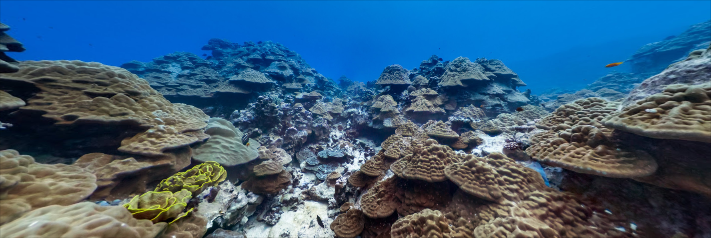

---

## 💭 First Thoughts

We're given an underwater picture of the ocean resembling some shroom-looking corals, like an atlantis that belongs to smurfs.

We are meant to find the cords of such city.

**Flags format:** `ITC{xxx.xxxx,xxxx.xxxx}`
Which means the cords are at the range of: `1xx, -1xx` OR `-xx, -1xx`

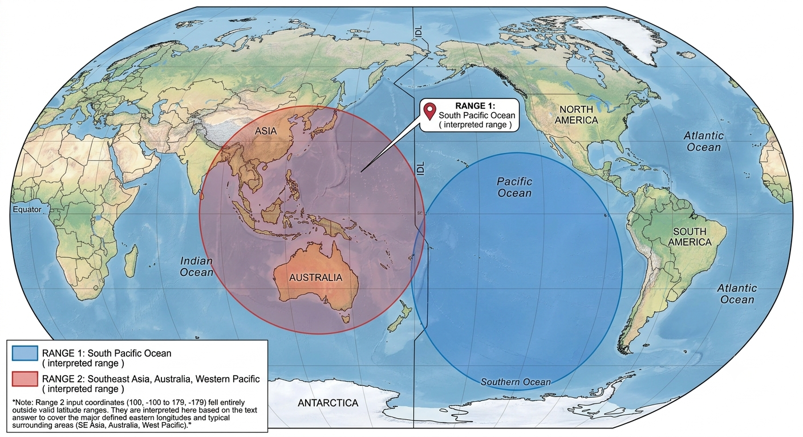

> **NOTE:** this image was generated after the end of the competition, to help provide a clear vision of our target during the writeup, 5damin riglo 🙂. Other tools may be used for this purpose like: FreeMapTools, GeoJSON.io, etc…

---

## 🔍 Hints from the Description

The description is divided into 3 parts:

**The first part**
_"Beyond the shoreline where the dark stone meets the tide, a silent, survey was conducted to map the architecture of the deep."_
Gives information about some sort of research, specifically a survey done to study the deeps of the area.

**The second part**
_"In late September 2017, near a funny named place, a digital gaze captured this subterranean passage, where gray, tiered plates stack like ancient steps"_
This part basically tells us a picture, recording or a satellite shot was taken of this place during sep/2017, and the name of the area is precisely worth a giggle.

**The third part**
_"To find your way, look for the point where the monochrome labyrinth is broken by a single, electric-neon anomaly resting at the base of the pillars"_
Some kind of riddle and wordplay to describe the place / area itself.

---

## 🧩 Solution

Lets start with the usual routine during any image osint ctf.

### Metadata Check

**METADATA with EXIFTOOL:**

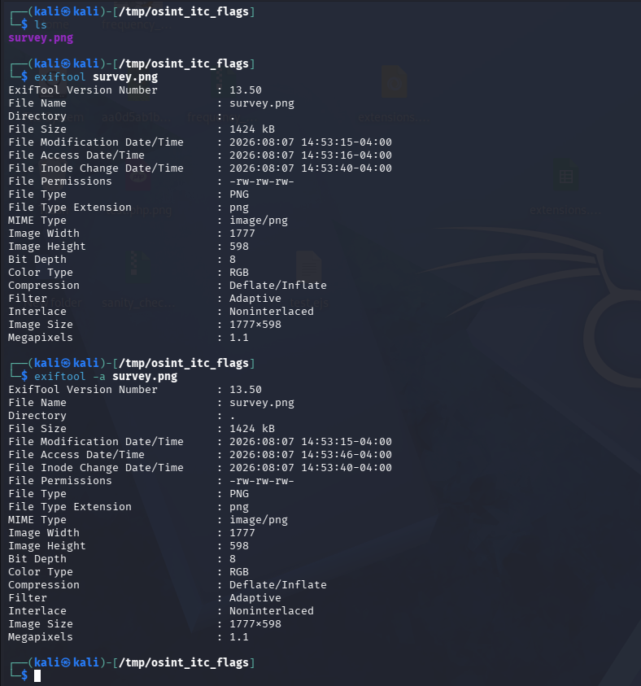

Didnt give us any useful information.

### Reverse Image Search

**- TinyEye:** this tool useful for exact-match image search

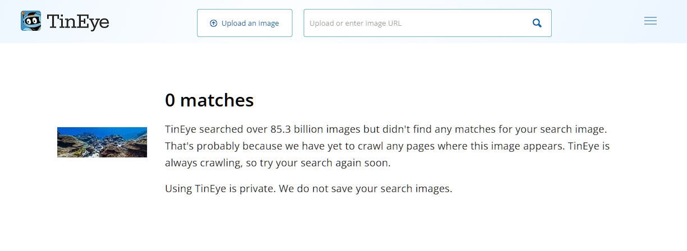

No results as well.

**Search engines:** no meaningful results was found using google lens, yandex or bing.
_Note: the ai overview was turned off in all cases._

---

### Pivoting to the Description Clues

Since the reverse search didnt really payoff, we're going to need to use the clues deduced from the description to get further.

With a simple google search **"google maps underwater street view"** we get two interesting results:

**1.** [underwater.earth/google-underwater-street-view](https://www.underwater.earth/google-underwater-street-view)

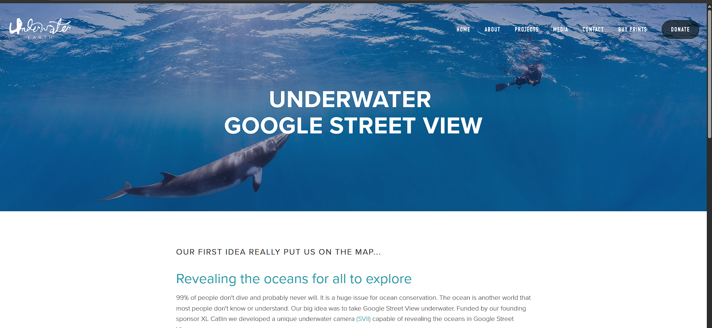

**2.** [scubadiving.com – explore underwater ocean google maps street view](https://www.scubadiving.com/article/news/explore-underwater-ocean-google-maps-street-view)

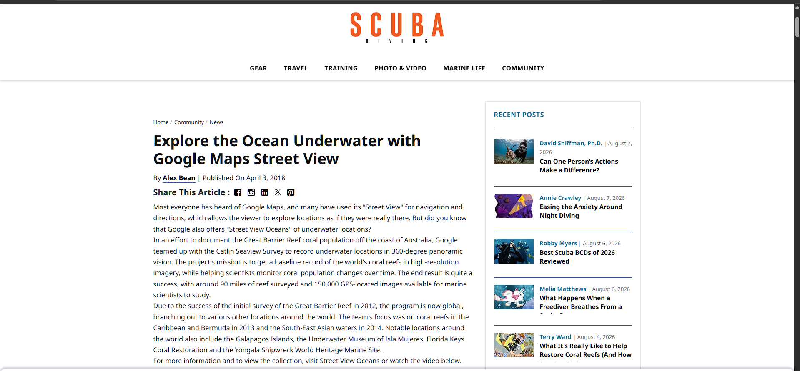

The first link teaches us about **Underwater Earth**, a non-profit organization that partnered with Google to research and study the ocean and underwater deeps. This gives us a root to search from — probably in Street View, where we can see the posts of their account during sep-2017.

While the second link is about an article that discusses the general **Catlin Seaview Survey** and Google's "Street View Oceans" project, which was published in 2018, thus aligning with the timeline and confirming the Underwater Earth significance for our challenge.

The article contained a very interesting piece of information as well:

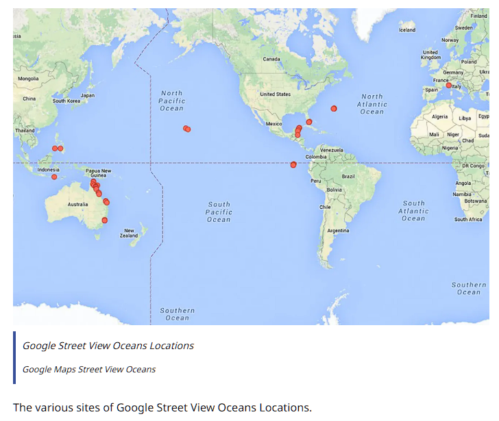

This image shows us the sites of Google Street View Oceans locations. Providing the drawn ranges and calculation we made earlier, we can guess approximately where our target might be.

---

### Evidence Utilization

Using the found map from earlier and some manual search we found the account for **Underwater Earth**:

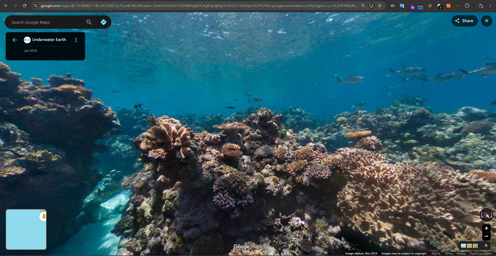

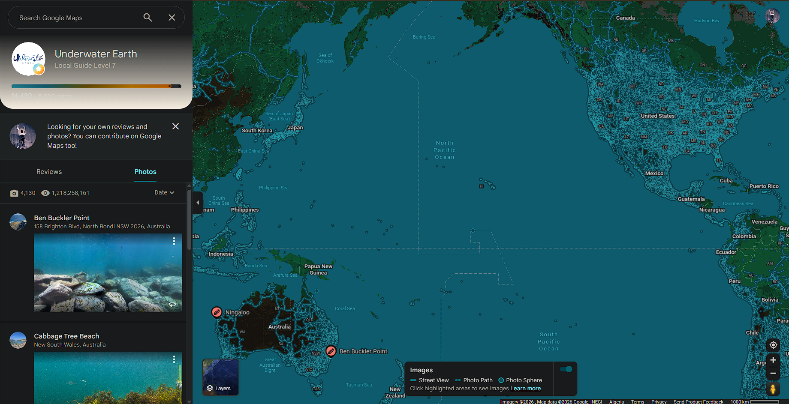

As well as **Catlin Seaview Survey** account:

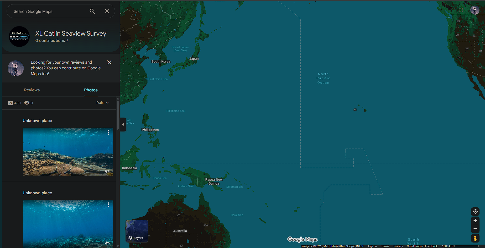

Since Underwater Earth has much more posts (10x more) we are going to go with that one first, using the date clue from the description:

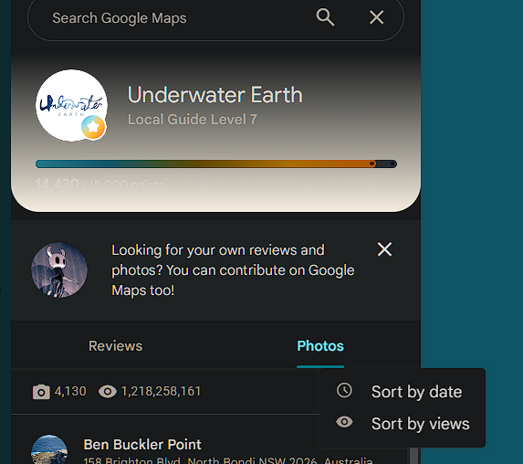

We sort the images accordingly and look for photos published at sep/2017 that meet our cords criteria.

---

### The Search

After a **VERY** time and ram consuming session of scrolling (google maps please add more filtering features), we started to see some familiar view:

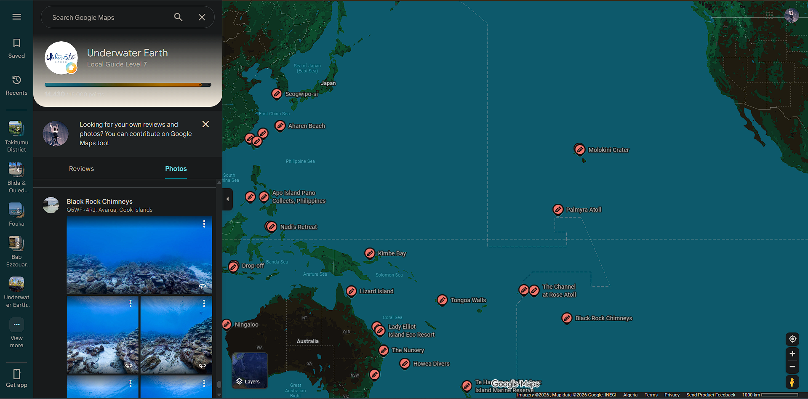

Verifying the date real quick, confirmed that we are on the right way:

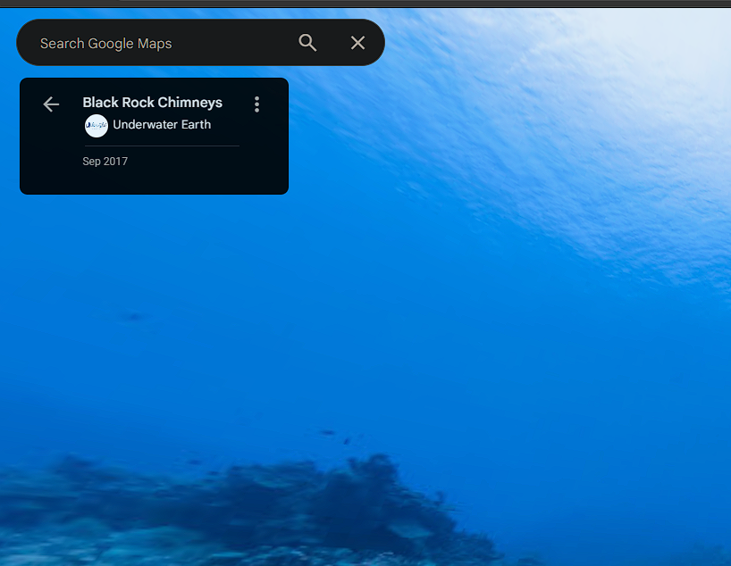

Since it mentioned "late" in the description, most likely our target is one of the last images in Sep. With a bit more of pattern recognition and questioning my eye sight capabilities (everything looks like the exact same), we managed to find our goal:

🔗 [Google Maps — target location](https://www.google.com/maps/@-21.2043577,-159.8259662,3a,75y,17.34h,72.07t/data=!3m8!1e1!3m6!1sCIHM0ogKEICAgICE7InXkwE!2e10!3e11!6shttps:%2F%2Flh3.googleusercontent.com%2Fgpms-cs-s%2FAFP8RcPFOH1Aci_YhnL_UNKIyQ0kfgr-yfCJw7psOLUZNm2aGYpAxBj6VyXXG6OCVeK_nO3-8p8B3zX9WfxYYAg6fdcKIXhpL96xJcbj0eOckPg8B1GKRJC27_pv604KYLC-kwj7com5%3Dw900-h600-k-no-pi17.930000000000007-ya330.55979522705076-ro0-fo100!7i9500!8i4750?entry=ttu&g_ep=EgoyMDI2MDgwNS4xIKXMDSoASAFQAw%3D%3D)

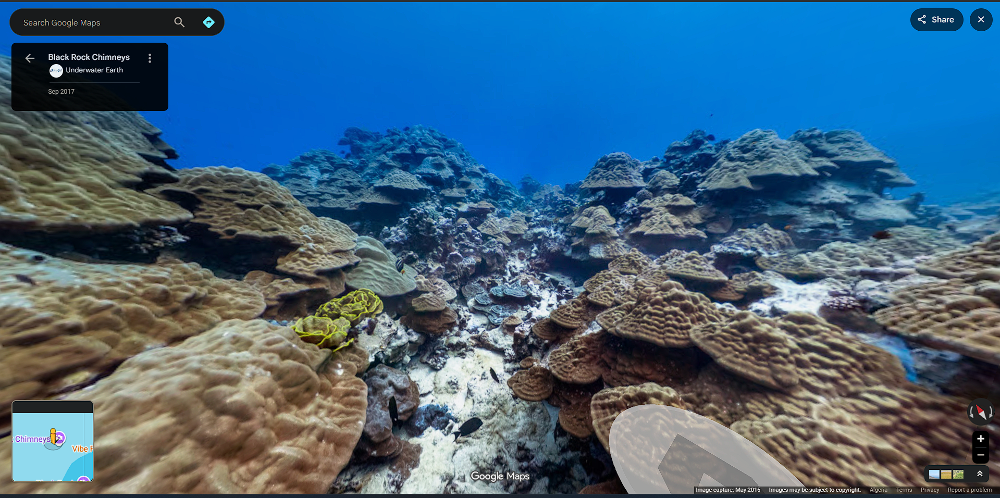

**How am I sure?** The yellowish flower made it easier, and the cords meet our range as well.

---

## 🚩 Flag

```
ITC{-21.2043,-159.8259}
```

> **NOTE:** apparently the funny name referred to **Cook Islands** — the smurf atlantis fits it better.
